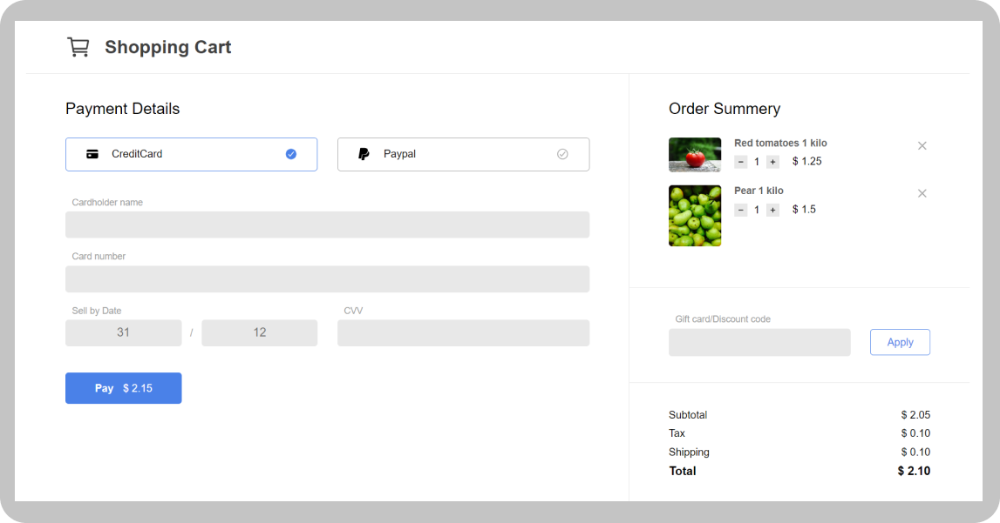

# Shopping Cart

 > Welcome to the Shopping Cart project! This is a simple web application that provides a basic shopping cart functionality. Users can add multiple items to their cart, view their cart, and proceed to checkout.

 

## Demo Screenshots

<a href="https://onlineshopper.netlify.app/"><strong>➥ Live Demo</strong></a>

## Features
- Calculate the total cost of items in the cart.
- Proceed to the checkout process.

